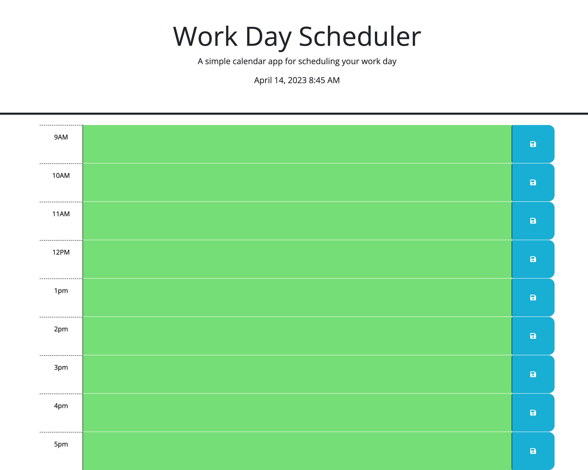

# 05 Organize Your Day / Work Day scheduler 

## Description
In this application the webpage meets accessibility standards. I added in a function to determine if the timeslots are past, present or future based off your time. It will color code each time accordingly throughout the day. In additon, anything typed in each time slot will be saved to local storage with the key being the timeslot it was written in military time. Recieved support from a peer for line 31 (variable: color).


## User Story

```
AS AN employee with a busy schedule
I WANT to add important events to a daily planner
SO THAT I can manage my time effectively
```

## Acceptance Criteria

```
GIVEN I am using a daily planner to create a schedule
WHEN I open the planner
THEN the current day is displayed at the top of the calendar
WHEN I scroll down
THEN I am presented with timeblocks for standard business hours
WHEN I view the timeblocks for that day
THEN each timeblock is color coded to indicate whether it is in the past, present, or future
WHEN I click into a timeblock
THEN I can enter an event
WHEN I click the save button for that timeblock
THEN the text for that event is saved in local storage
WHEN I refresh the page
THEN the saved events persist
```


## Screenshot



## Deploy Application

[Scheduler](https://jjennifer.github.io/Time-Management-Work-Day-Scheduler-APIs/)